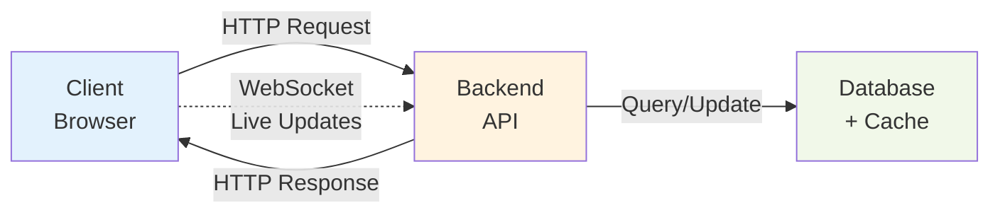

# Real-time Scoreboard API - Architecture Design

## Problem Analysis

### Requirements
1. ✅ Display top 10 users on scoreboard
2. ✅ Live updates when scores change
3. ✅ Users perform actions → API call → update score
4. ✅ Prevent malicious score manipulation

### Key Challenges
- **Security**: How to prevent users from faking scores?
- **Real-time**: How to push updates to all clients instantly?
- **Performance**: How to handle many concurrent updates?
- **Data Consistency**: How to ensure accurate rankings?

---

## Solution Architecture

### High-Level Overview

```
┌─────────────┐         ┌─────────────┐         ┌──────────────┐
│   Client    │────────>│   Backend   │────────>│   Database   │
│  (Browser)  │<────────│   API       │         │  + Cache     │
└─────────────┘         └─────────────┘         └──────────────┘
      │                        │
      │                        │
      └────WebSocket───────────┘
         (Live Updates)
```

---

## Core Design Ideas

### 1. Security Strategy: Server-Side Validation

**Problem**: Users can manipulate client-side code and send fake scores.

**Solution**: Never trust the client!

```javascript
// ❌ BAD - Client sends score
POST /api/score/update
{
  "score_delta": 1000  // User can fake this!
}

// ✅ GOOD - Client sends action proof
POST /api/score/update
{
  "action_id": "uuid-123",
  "action_type": "COMPLETE_TASK",
  "token": "signed-proof-from-server"
}
// Server calculates: score_delta = 10 points
```

**Implementation Flow**:
```
1. User performs action (e.g., completes task)
2. Client sends action proof (signed token)
3. Server validates the proof
4. Server calculates score based on action type
5. Server updates database
```
```mermaid
sequenceDiagram
    participant User
    participant Client
    participant API as API Server
    participant Auth as Auth Service
    participant DB as Database
    participant Redis
    participant WS as WebSocket Hub

    User->>Client: 1. Performs action<br/>(e.g., completes task)
    
    Client->>API: 2. POST /api/score/update<br/>{action_id, action_type, token}
    
    rect rgb(255, 240, 240)
        Note over API,Auth: Security Validation
        API->>Auth: 3a. Verify JWT token
        Auth-->>API: Token valid
        API->>API: 3b. Verify action signature
        API->>Redis: 3c. Check action_id used before?
        Redis-->>API: Not used (OK)
        API->>API: 3d. Check rate limit
    end
    
    rect rgb(240, 255, 240)
        Note over API,DB: Score Calculation & Update
        API->>API: 4. Calculate score_delta<br/>based on action_type<br/>(server-side calculation)
        
        API->>DB: 5a. BEGIN TRANSACTION
        API->>DB: 5b. UPDATE users<br/>SET score = score + delta
        API->>DB: 5c. INSERT INTO score_history
        API->>DB: 5d. COMMIT
        DB-->>API: Transaction complete
    end
    
    rect rgb(240, 245, 255)
        Note over API,WS: Cache & Broadcast Update
        API->>Redis: 6a. Update cache<br/>ZADD scoreboard:top
        API->>Redis: 6b. PUBLISH "score_updated"
        Redis->>WS: 6c. Notify all servers
        WS->>Client: 7. WebSocket push<br/>New scoreboard data
    end
    
    API-->>Client: 8. Response: {new_score, rank}
    Client->>User: 9. Display updated score 
 ```
**Key Security Layers**:
- **JWT Authentication**: Verify user identity
- **Action Token**: Each action gets a server-signed token
- **Idempotency**: Each action_id can only be used once
- **Rate Limiting**: Max 100 actions/hour per user
- **Timestamp Check**: Reject old requests (> 5 minutes)

---

### 2. Real-time Updates: WebSocket + Redis Pub/Sub

**Problem**: How to notify all connected users instantly?

**Solution**: WebSocket for push + Redis Pub/Sub for coordination

```
┌─────────────────────────────────────────────┐
│          When Score Updates:                │
│                                             │
│  1. User A completes action                │
│  2. API updates database                   │
│  3. API publishes to Redis: "score_updated"│
│  4. All API servers receive the message    │
│  5. Each server pushes to connected clients│
└─────────────────────────────────────────────┘
```

**WebSocket Implementation**:
```javascript
// Client connects
ws://api.example.com/scoreboard/live

// Server pushes updates
{
  "type": "SCOREBOARD_UPDATE",
  "data": {
    "top_users": [
      {"rank": 1, "username": "Alice", "score": 1500},
      {"rank": 2, "username": "Bob", "score": 1200},
      ...
    ]
  }
}
```

**Why Redis Pub/Sub?**
- Multiple API servers can run (horizontal scaling)
- All servers need to know about score changes
- Redis acts as message broker between servers

---

### 3. Performance: Caching Strategy

**Problem**: Querying database for top 10 on every request is slow.

**Solution**: Multi-level caching

```
┌──────────────────────────────────────┐
│  Cache Layer 1: Redis Sorted Set    │
│  - Store top 100 users               │
│  - Update on score change            │
│  - Query time: O(log N)              │
└──────────────────────────────────────┘
         ↓
┌──────────────────────────────────────┐
│  Cache Layer 2: In-Memory Cache      │
│  - Cache API response for 1 second   │
│  - Serve thousands of requests       │
└──────────────────────────────────────┘
         ↓
┌──────────────────────────────────────┐
│  Database: Source of Truth           │
│  - Only update, rarely query         │
└──────────────────────────────────────┘
```

**Redis Data Structure**:
```redis
# Sorted Set (ZSET) - automatically sorted by score
ZADD scoreboard:top 1500 "user:alice"
ZADD scoreboard:top 1200 "user:bob"

# Get top 10
ZREVRANGE scoreboard:top 0 9 WITHSCORES
```

---

### 4. Data Consistency: Transaction + Optimistic Locking

**Problem**: What if two actions update score simultaneously?

**Solution**: Database transactions

```sql
-- Atomic operation
BEGIN TRANSACTION;

-- Update user score
UPDATE users 
SET score = score + 10,
    version = version + 1  -- Optimistic locking
WHERE id = 'user-123' AND version = 5;

-- Record history
INSERT INTO score_history (user_id, action_id, delta)
VALUES ('user-123', 'action-456', 10);

COMMIT;
```

---

## API Design

### 1. Score Update Endpoint

```http
POST /api/v1/score/update
Authorization: Bearer <jwt_token>
Content-Type: application/json

{
  "action_id": "550e8400-e29b-41d4-a716-446655440000",
  "action_type": "COMPLETE_TASK",
  "action_token": "server-signed-token-abc123",
  "timestamp": 1698765432
}
```

**Response**:
```json
{
  "success": true,
  "data": {
    "new_score": 1510,
    "rank": 5,
    "score_delta": 10
  }
}
```

### 2. Get Scoreboard Endpoint

```http
GET /api/v1/scoreboard/top?limit=10
```

**Response**:
```json
{
  "success": true,
  "data": [
    {
      "rank": 1,
      "username": "Alice",
      "score": 1500,
      "avatar": "https://..."
    }
  ],
  "last_updated": "2024-10-30T10:30:00Z"
}
```

### 3. WebSocket Live Updates

```javascript
// Client
const ws = new WebSocket('wss://api.example.com/scoreboard/live');

ws.onmessage = (event) => {
  const update = JSON.parse(event.data);
  // Update UI with new rankings
  updateScoreboard(update.data.top_users);
};
```

---

## Database Schema

### Simple & Effective Design

```sql
-- Users table
CREATE TABLE users (
    id UUID PRIMARY KEY,
    username VARCHAR(50) UNIQUE,
    email VARCHAR(255) UNIQUE,
    score BIGINT DEFAULT 0,
    created_at TIMESTAMP DEFAULT NOW(),
    updated_at TIMESTAMP DEFAULT NOW()
);

-- Index for fast sorting
CREATE INDEX idx_users_score ON users(score DESC);

-- Score history (audit trail)
CREATE TABLE score_history (
    id BIGSERIAL PRIMARY KEY,
    user_id UUID REFERENCES users(id),
    action_id UUID UNIQUE,  -- Prevent duplicate actions
    action_type VARCHAR(50),
    score_delta INT,
    old_score BIGINT,
    new_score BIGINT,
    created_at TIMESTAMP DEFAULT NOW()
);

CREATE INDEX idx_score_history_user ON score_history(user_id);
CREATE INDEX idx_score_history_action ON score_history(action_id);
```

---

## Execution Flow Diagram

### Complete Flow: User Action → Score Update → Live Broadcast

```
┌──────────┐
│  Client  │
└────┬─────┘
     │
     │ 1. User completes task
     │    Client requests action token
     ▼
┌─────────────┐
│ GET /action │
│   /token    │
└─────┬───────┘
      │
      │ 2. Server generates signed token
      │    with action metadata
      ▼
┌──────────┐
│  Client  │ 3. Client submits action
└────┬─────┘    with token
     │
     │ POST /score/update
     ▼
┌─────────────────────────────────────┐
│         API Server                  │
│                                     │
│  4. Validate JWT                   │
│  5. Verify action token signature  │
│  6. Check rate limit               │
│  7. Verify action_id unique        │
└─────────────┬───────────────────────┘
              │
              │ 8. Begin transaction
              ▼
        ┌──────────┐
        │ Database │
        └────┬─────┘
             │
             │ 9. UPDATE users SET score = score + 10
             │ 10. INSERT score_history
             │ 11. COMMIT
             ▼
        ┌─────────┐
        │  Redis  │ 12. ZADD scoreboard:top 1510 user:123
        └────┬────┘ 13. PUBLISH "score_updated" event
             │
             ▼
    ┌─────────────────┐
    │ Redis Pub/Sub   │ 14. All API servers receive event
    └────┬────────────┘
         │
         ├────────────┬────────────┬────────────┐
         ▼            ▼            ▼            ▼
    ┌────────┐  ┌────────┐  ┌────────┐  ┌────────┐
    │Server 1│  │Server 2│  │Server 3│  │Server N│
    └───┬────┘  └───┬────┘  └───┬────┘  └───┬────┘
        │           │           │           │
        │ 15. Fetch updated top 10 from Redis
        │           │           │           │
        ▼           ▼           ▼           ▼
    ┌────────────────────────────────────────────┐
    │     WebSocket: Broadcast to all clients    │
    └────────────────────────────────────────────┘
                     │
        ┌────────────┼────────────┐
        ▼            ▼            ▼
    ┌────────┐  ┌────────┐  ┌────────┐
    │Client A│  │Client B│  │Client N│
    └────────┘  └────────┘  └────────┘
         │            │            │
         │ 16. Update UI with new rankings
         └────────────┴────────────┘
```

---

 ```mermaid
 sequenceDiagram
    participant Client
    participant API as API Server
    participant DB as Database
    participant Redis
    participant WS as WebSocket

    Note over Client: User completes task
    Client->>API: 1. GET /action/token<br/>Request action token
    
    Note over API: 2. Generate signed token<br/>with action metadata
    API-->>Client: Return: {action_id, token}
    
    Client->>API: 3. POST /score/update<br/>{action_id, action_type, token}
    
    rect rgb(255, 245, 235)
        Note over API: Validation Layer
        Note over API: 4. Validate JWT
        Note over API: 5. Verify action token signature
        Note over API: 6. Check rate limit
        Note over API: 7. Verify action_id unique
    end
    
    rect rgb(235, 245, 255)
        Note over API,DB: Database Transaction
        API->>DB: 8. BEGIN TRANSACTION
        API->>DB: 9. UPDATE users<br/>SET score = score + 10
        API->>DB: 10. INSERT score_history
        API->>DB: 11. COMMIT
        DB-->>API: Success
    end
    
    rect rgb(240, 255, 240)
        Note over API,Redis: Cache & Event
        API->>Redis: 12. ZADD scoreboard:top<br/>1510 user:123
        API->>Redis: 13. PUBLISH "score_updated"
    end
    
    API-->>Client: Response: {new_score, rank}
    
    rect rgb(255, 240, 245)
        Note over Redis,WS: Broadcast Update
        Redis->>API: 14. Event received
        Note over API: 15. Fetch updated top 10<br/>from Redis
        API->>WS: 16. Send via WebSocket
        WS->>Client: Broadcast new scoreboard
    end
    
    Note over Client: 17. Update UI<br/>with new rankings
 ```
## Security Implementation

### Action Token Flow (Prevent Fraud)

```
Step 1: User requests to perform action
┌─────────┐
│ Client  │ GET /api/action/start?type=COMPLETE_TASK
└────┬────┘
     ▼
┌─────────┐
│ Server  │ Creates action token:
└────┬────┘   token = HMAC(user_id + action_type + timestamp + secret)
     │        Returns: { action_id: "...", token: "..." }
     ▼
┌─────────┐
│ Client  │ Stores token temporarily
└─────────┘

Step 2: User completes action
┌─────────┐
│ Client  │ POST /api/score/update
└────┬────┘   { action_id, action_type, token }
     ▼
┌─────────┐
│ Server  │ 1. Verify token signature
└────┬────┘ 2. Check action_id not used before (Redis)
     │      3. Validate timestamp (< 5 min old)
     │      4. Update score
     ▼
```

### Rate Limiting (Prevent Spam)

```javascript
// Redis-based rate limiter
async function checkRateLimit(userId) {
  const key = `ratelimit:${userId}:${getCurrentHour()}`;
  const count = await redis.incr(key);
  
  if (count === 1) {
    await redis.expire(key, 3600); // 1 hour
  }
  
  if (count > 100) {
    throw new Error('Rate limit exceeded');
  }
}
```

---

## Technology Stack Recommendations

### Backend
- **Language**: Node.js (TypeScript) or Go
- **Framework**: Express.js / Fastify (Node) or Gin (Go)
- **Database**: PostgreSQL (reliable, ACID compliant)
- **Cache**: Redis (sorted sets + pub/sub)
- **WebSocket**: Socket.io or native ws library

### Infrastructure
- **Load Balancer**: Nginx / AWS ALB
- **Container**: Docker
- **Orchestration**: Kubernetes (for scaling)
- **Monitoring**: Prometheus + Grafana

---

## Scalability Considerations

### Horizontal Scaling Strategy

```
┌─────────────────────────────────────────┐
│      Load Balancer                      │
│  (Sticky sessions for WebSocket)        │
└──────────┬──────────────────────────────┘
           │
     ┌─────┼─────┬─────┬─────┐
     ▼     ▼     ▼     ▼     ▼
   [API] [API] [API] [API] [API]  ← Stateless servers
     │     │     │     │     │
     └─────┴─────┴─────┴─────┘
            │
            ▼
    ┌──────────────┐
    │ Redis Cluster│  ← Shared state
    └──────────────┘
            │
            ▼
    ┌──────────────┐
    │   Database   │
    │  (Primary +  │
    │   Replicas)  │
    └──────────────┘
```

**Key Points**:
- API servers are stateless (can scale horizontally)
- Redis handles shared state (cache + pub/sub)
- Database uses read replicas for queries
- Load balancer uses sticky sessions for WebSocket

---

## Testing Strategy

### 1. Unit Tests
- Score calculation logic
- Token signing/verification
- Rate limiter logic

### 2. Integration Tests
- Complete flow: action → update → broadcast
- Database transaction rollback
- Cache invalidation

### 3. Load Tests
- 1000 concurrent users
- 100 score updates/second
- WebSocket connection stress test

### 4. Security Tests
- Try to replay old action tokens
- Attempt rate limit bypass
- SQL injection tests

---

## Potential Issues & Solutions

### Issue 1: Race Conditions
**Problem**: Two actions update same user simultaneously
**Solution**: Database transactions with row-level locking

### Issue 2: WebSocket Reconnection
**Problem**: User disconnects and misses updates
**Solution**: Send sequence number with each update, client can request missed updates

### Issue 3: Cache Inconsistency
**Problem**: Redis cache out of sync with database
**Solution**: Use write-through cache pattern, database is source of truth

### Issue 4: Thundering Herd
**Problem**: Cache expires, 1000 requests hit database
**Solution**: Use cache warming + stale-while-revalidate pattern

---

## Future Improvements

### Phase 2 Features
1. **Regional Leaderboards**: Separate rankings by country/region
2. **Time-based Boards**: Daily, weekly, monthly rankings
3. **Achievement System**: Badges for milestones
4. **Friends Leaderboard**: Only show friends' scores

### Advanced Security
1. **Machine Learning**: Detect abnormal patterns
2. **Device Fingerprinting**: Detect multi-accounting
3. **CAPTCHA**: For suspicious activities
4. **2FA**: For high-value actions

### Performance Enhancements
1. **GraphQL Subscriptions**: Alternative to WebSocket
2. **Edge Caching**: CDN for read-heavy data
3. **Event Sourcing**: Store all events for audit
4. **CQRS**: Separate read/write models

---

## Summary

### Architecture Highlights
✅ **Secure**: Multi-layer validation, server-side scoring
✅ **Real-time**: WebSocket + Redis Pub/Sub
✅ **Scalable**: Stateless servers, horizontal scaling
✅ **Performant**: Multi-level caching strategy
✅ **Reliable**: ACID transactions, audit trail

### Key Design Decisions
1. **Never trust client** - All score calculations on server
2. **Action tokens** - Cryptographically signed proofs
3. **Redis Sorted Sets** - O(log N) ranking queries
4. **WebSocket** - Push updates instead of polling
5. **Idempotency** - Each action can only succeed once

### Implementation Priority
1. **Phase 1**: Basic API + Security (Week 1-2)
2. **Phase 2**: Caching + Performance (Week 3)
3. **Phase 3**: WebSocket + Real-time (Week 4)
4. **Phase 4**: Monitoring + Testing (Week 5)

This design balances security, performance, and scalability while remaining practical to implement.
