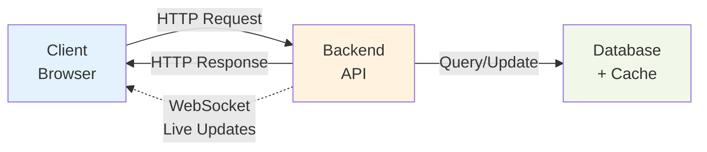

# Problem 6: Architecture 
## Task
Write the specification for a software module on the API service (backend application server).

1. Create a documentation for this module on a `README.md` file.
2. Create a diagram to illustrate the flow of execution. 
3. Add additional comments for improvement you may have in the documentation.
4. Your specification will be given to a backend engineering team to implement.
   
### Software Requirements
1. We have a website with a score board, which shows the top 10 user’s scores.
2. We want live update of the score board.
3. User can do an action (which we do not need to care what the action is), completing this action will increase the user’s score.
4. Upon completion the action will dispatch an API call to the application server to update the score.
5. We want to prevent malicious users from increasing scores without authorisation.

## Problem Analysis

### Requirements
1.  Display top 10 users on scoreboard
2.  Live updates when scores change
3.  Users perform actions → API call → update score
4.  Prevent malicious score manipulation

---

## Solution Architecture

### Overview

---

## Core Design Ideas

### 1. Security: Server-Side Validation

**Problem**: Users can manipulate client-side code and send fake scores.

**Solution**: Never trust the client!

```javascript
// ❌ BAD - Client sends score
POST /api/score/update
{
  "score_delta": 1000  // User can fake this!
}

// ✅ GOOD - Client sends action proof
POST /api/score/update
{
  "action_id": "uuid-123",
  "action_type": "COMPLETE_TASK",
  "token": "signed-proof-from-server"
}
// Server calculates: score_delta = 10 points
```

**Implementation Flow**:
```
1. User performs action (e.g., completes task)
2. Client sends action proof (signed token)
3. Server validates the proof
4. Server calculates score based on action type
5. Server updates database
```
```mermaid
sequenceDiagram
    participant User
    participant Client
    participant API as API Server
    participant Auth as Auth Service
    participant DB as Database
    participant Redis
    participant WS as WebSocket Hub

    User->>Client: 1. Performs action<br/>(e.g., completes task)
    
    Client->>API: 2. POST /api/score/update<br/>{action_id, action_type, token}
    
    rect rgb(255, 240, 240)
        Note over API,Auth: Security Validation
        API->>Auth: 3a. Verify JWT token
        Auth-->>API: Token valid
        API->>API: 3b. Verify action signature
        API->>Redis: 3c. Check action_id used before?
        Redis-->>API: Not used (OK)
        API->>API: 3d. Check rate limit
    end
    
    rect rgb(240, 255, 240)
        Note over API,DB: Score Calculation & Update
        API->>API: 4. Calculate score_delta<br/>based on action_type<br/>(server-side calculation)
        
        API->>DB: 5a. BEGIN TRANSACTION
        API->>DB: 5b. UPDATE users<br/>SET score = score + delta
        API->>DB: 5c. INSERT INTO score_history
        API->>DB: 5d. COMMIT
        DB-->>API: Transaction complete
    end
    
    rect rgb(240, 245, 255)
        Note over API,WS: Cache & Broadcast Update
        API->>Redis: 6a. Update cache<br/>ZADD scoreboard:top
        API->>Redis: 6b. PUBLISH "score_updated"
        Redis->>WS: 6c. Notify all servers
        WS->>Client: 7. WebSocket push<br/>New scoreboard data
    end
    
    API-->>Client: 8. Response: {new_score, rank}
    Client->>User: 9. Display updated score 
 ```
**Key Security Layers**:
- **JWT Authentication**: Verify user identity
- **Action Token**: Each action gets a server-signed token
- **Idempotency**: Each action_id can only be used once
- **Rate Limiting**: Max 100 actions/hour per user
- **Timestamp Check**: Reject old requests (> 5 minutes)

---

### 2. Real-time Updates: WebSocket + Redis Pub/Sub

**Problem**: How to notify all connected users instantly?

**Solution**: WebSocket for push + Redis Pub/Sub for coordination
                                                       
    When Score Updates:
    1. User A completes action                
    2. API updates database                   
    3. API publishes to Redis: "score_updated"
    4. All API servers receive the message    
    5. Each server pushes to connected clients
```

**WebSocket Implementation**:
```javascript
// Client connects
ws://api.example.com/scoreboard/live

// Server pushes updates
{
  "type": "SCOREBOARD_UPDATE",
  "data": {
    "top_users": [
      {"rank": 1, "username": "Alice", "score": 1500},
      {"rank": 2, "username": "Bob", "score": 1200},
      ...
    ]
  }
}
```

**Why Redis Pub/Sub?**
- Multiple API servers can run (horizontal scaling)
- All servers need to know about score changes
- Redis acts as message broker between servers

---

### 3. Performance: Caching Strategy

**Problem**: Querying database for top 10 on every request is slow.

**Solution**: Multi-level caching


**Redis Data Structure**:
```redis
# Sorted Set (ZSET) - automatically sorted by score
ZADD scoreboard:top 1500 "user:alice"
ZADD scoreboard:top 1200 "user:bob"

# Get top 10
ZREVRANGE scoreboard:top 0 9 WITHSCORES
```

---

### 4. Data Consistency: Transaction + Optimistic Locking

**Problem**: What if two actions update score simultaneously?

**Solution**: Database transactions

```sql
-- Atomic operation
BEGIN TRANSACTION;

-- Update user score
UPDATE users 
SET score = score + 10,
    version = version + 1  -- Optimistic locking
WHERE id = 'user-123' AND version = 5;

-- Record history
INSERT INTO score_history (user_id, action_id, delta)
VALUES ('user-123', 'action-456', 10);

COMMIT;
```

---

## API Design

### 1. Score Update Endpoint

```http
POST /api/v1/score/update
Authorization: Bearer <jwt_token>
Content-Type: application/json

{
  "action_id": "550e8400-e29b-41d4-a716-446655440000",
  "action_type": "COMPLETE_TASK",
  "action_token": "server-signed-token-abc123",
  "timestamp": 1698765432
}
```

**Response**:
```json
{
  "success": true,
  "data": {
    "new_score": 1510,
    "rank": 5,
    "score_delta": 10
  }
}
```

### 2. Get Scoreboard Endpoint

```http
GET /api/v1/scoreboard/top?limit=10
```

**Response**:
```json
{
  "success": true,
  "data": [
    {
      "rank": 1,
      "username": "Alice",
      "score": 1500,
      "avatar": "https://..."
    }
  ],
  "last_updated": "2024-10-30T10:30:00Z"
}
```

### 3. WebSocket Live Updates

```javascript
// Client
const ws = new WebSocket('wss://api.example.com/scoreboard/live');

ws.onmessage = (event) => {
  const update = JSON.parse(event.data);
  // Update UI with new rankings
  updateScoreboard(update.data.top_users);
};
```

---

## Database Schema

### Simple & Effective Design

```sql
-- Users table
CREATE TABLE users (
    id UUID PRIMARY KEY,
    username VARCHAR(50) UNIQUE,
    email VARCHAR(255) UNIQUE,
    score BIGINT DEFAULT 0,
    created_at TIMESTAMP DEFAULT NOW(),
    updated_at TIMESTAMP DEFAULT NOW()
);

-- Index for fast sorting
CREATE INDEX idx_users_score ON users(score DESC);

-- Score history (audit trail)
CREATE TABLE score_history (
    id BIGSERIAL PRIMARY KEY,
    user_id UUID REFERENCES users(id),
    action_id UUID UNIQUE,  -- Prevent duplicate actions
    action_type VARCHAR(50),
    score_delta INT,
    old_score BIGINT,
    new_score BIGINT,
    created_at TIMESTAMP DEFAULT NOW()
);

CREATE INDEX idx_score_history_user ON score_history(user_id);
CREATE INDEX idx_score_history_action ON score_history(action_id);
```

---

## Execution Flow Diagram

### Complete Flow: User Action → Score Update → Live Broadcast
---

 ```mermaid
 flowchart TD
    Start([User performs action]) --> RequestToken[Client requests action token<br/>GET /api/action/start]
    
    RequestToken --> GenerateToken[Server generates signed token]
    
    GenerateToken --> ReturnToken[Return action_id + token<br/>to client]
    
    ReturnToken --> SubmitAction["Client submits action<br/>POST /api/score/update<br/>(action_id, action_type, token)"]
    
    SubmitAction --> Validate{Validation<br/>Layers}
    
    Validate -->|Failed| Reject([❌ Reject Request])
    
    Validate -->|Passed| CalcScore[Server calculates<br/>score_delta based on<br/>action_type]
    
    CalcScore --> Transaction[Database Transaction:<br/>1. UPDATE users score<br/>2. INSERT score_history<br/>3. COMMIT]
    
    Transaction --> UpdateCache[Update Redis Cache:<br/>ZADD scoreboard:top]
    
    UpdateCache --> Publish[Publish Event:<br/>PUBLISH score_updated]
    
    Publish --> Response[Return Response:<br/>new_score, rank]
    
    Publish --> Broadcast[Broadcast via WebSocket<br/>to all connected clients]
    
    Broadcast --> UpdateUI([Clients update UI<br/>with new scoreboard])
    
    Response --> End([✅ Complete])
    UpdateUI --> End
    
    style Start fill:#e3f2fd
    style Validate fill:#fff3e0
    style Transaction fill:#f3e5f5
    style Broadcast fill:#e8f5e9
    style End fill:#c8e6c9
    style Reject fill:#ffcdd2
 ```
## Security Implementation

### Action Token Flow (Prevent Fraud)

```
Step 1: User requests to perform action
┌─────────┐
│ Client  │ GET /api/action/start?type=COMPLETE_TASK
└────┬────┘
     ▼
┌─────────┐
│ Server  │ Creates action token:
└────┬────┘   token = HMAC(user_id + action_type + timestamp + secret)
     │        Returns: { action_id: "...", token: "..." }
     ▼
┌─────────┐
│ Client  │ Stores token temporarily
└─────────┘

Step 2: User completes action
┌─────────┐
│ Client  │ POST /api/score/update
└────┬────┘   { action_id, action_type, token }
     ▼
┌─────────┐
│ Server  │ 1. Verify token signature
└────┬────┘ 2. Check action_id not used before (Redis)
     │      3. Validate timestamp (< 5 min old)
     │      4. Update score
     ▼
```

### Rate Limiting (Prevent Spam)

```javascript
// Redis-based rate limiter
async function checkRateLimit(userId) {
  const key = `ratelimit:${userId}:${getCurrentHour()}`;
  const count = await redis.incr(key);
  
  if (count === 1) {
    await redis.expire(key, 3600); // 1 hour
  }
  
  if (count > 100) {
    throw new Error('Rate limit exceeded');
  }
}
```

---

## Technology Stack Recommendations

### Backend
- **Language**: Node.js (TypeScript)
- **Framework**: Express.js 
- **Database**: PostgreSQL 
- **Cache**: Redis
- **WebSocket**: Socket.io 

---


## Potential Issues & Solutions

### Issue 1: Race Conditions
**Problem**: Two actions update same user simultaneously
**Solution**: Database transactions with row-level locking

### Issue 2: WebSocket Reconnection
**Problem**: User disconnects and misses updates
**Solution**: Send sequence number with each update, client can request missed updates

### Issue 3: Cache Inconsistency
**Problem**: Redis cache out of sync with database
**Solution**: Use write-through cache pattern, database is source of truth

---

## Future Improvements

### Features
1. **Regional Leaderboards**: Separate rankings by country/region
2. **Time-based Boards**: Daily, weekly, monthly rankings
3. **Achievement System**: Badges for milestones
4. **Friends Leaderboard**: Only show friends' scores

### Advanced Security
1. **Machine Learning**: Detect abnormal patterns
2. **Device Fingerprinting**: Detect multi-accounting
4. **2FA**: For high-value actions

### Performance Enhancements
1. **GraphQL Subscriptions**: Alternative to WebSocket
3. **Event Sourcing**: Store all events for audit
4. **CQRS**: Separate read/write models

---
