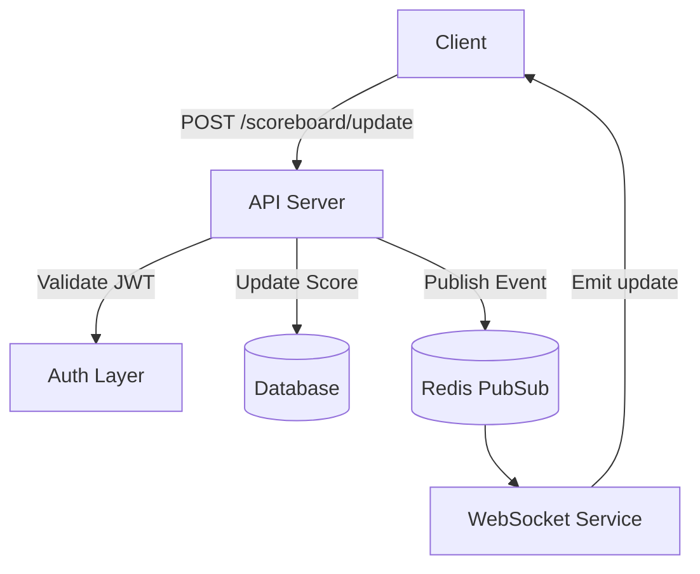
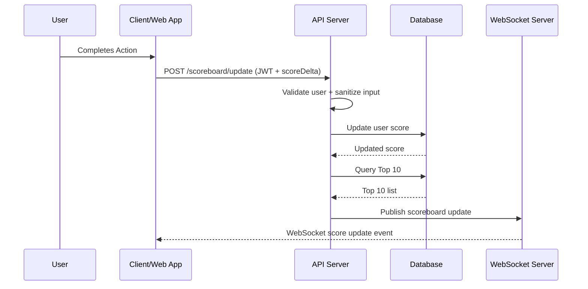

# Scoreboard Module (Backend)

A backend module supporting real-time scoreboard updates with secure score modification.

### Software Requirements
 * We have a website with a score board, which shows the top 10 user’s scores.
 * We want live update of the score board.
 * User can do an action (which we do not need to care what the action is), completing this action will increase the user’s score.
 * Upon completion the action will dispatch an API call to the application server to update the score.
 * We want to prevent malicious users from increasing scores without authorisation.

## Overview

This module manages user scores and provides a real-time scoreboard showing the **Top 10 highest scoring users**. Scores are updated through authenticated events triggered by valid user actions.

---

##  Features

* Secure score update via authenticated API call
* Real-time scoreboard broadcast via WebSocket
* Top 10 users query with caching support
* Action logging to prevent malicious behaviour
* Scalable architecture (Redis Pub/Sub recommended)

---

## Tech Stack

| Layer            | Technology                 |
| ---------------- | -------------------------- |
| API Backend      | Node.js + Express / NestJS |
| Database         | PostgreSQL / MongoDB       |
| Caching + PubSub | Redis                      |
| Real-time        | WebSocket / Socket.IO      |
| Auth             | JWT based authentication   |

> Technologies are interchangeable based on company stack.
## Architecture



## Database
#### User Table
- `userId` - primary key (auto-increment)
- `userName` - unique
- `score`- user's current score (default to 0) (int)
- email - unique
- password - hashed
- ... additional fields as required
#### Action Table
- `actionId` - ...
- `actionName` - unique name of the action
- `score` - point awarded for the action (must me > 0) (int)
- desription - action details
- ... additional fields as required
#### Scoreboard Cache
- Key: `scoreboard:top10`
- Value: Sorted list of user IDs and their scores
## API Specification
### Get User details
Endpoint: /api/user/:userId
- Method: GET
- Desc: Retriveves detaild information about a specific user, including their current score
- Request Params: userId - the id of the use
- Response: 
 ```json
{
    "userId": 1,
    "userName": "quanna24",
    ...
    "score": 1000
}
``` 
###  Update Score API

- Endpoint: `/api/score/update`
- Method: `POST`
- Desc: Updates the user's score upon completion of an action, validates the user and ensures the action is authorized
- Request Body:
```json
{
    "userId": 1,
    "actionId": 2,
}
```
but required authentication and authorization (using api-key or bearer token, ...)
- Response:
```json
{
    "status": "success",
    "message": "Score updated successfully",
    ...
    "updatedScore": 1500
}
```
or (on failure)
```json
{
    "status": "error",
    "message": "Unauthorized action or invalid token"
}
```

### Get Top 10 Scores API

`GET /api/scoreboard/top`

- Endpoint: `/api/scoreboard/top10`
- Method: `GET`
- Desc: Retrieves the top 10 scores
- Request Params: None
- Response:
```json
[
  { "userId": "u1", "userName": "quanna24", "score": 120 },
  { "userId": "u2", "userName": "abcdd", "score": 95 }
]
```

---
## Security Considerations
**1. Authentication & Authorization:**
- Enforce authentication for all API requests
- Can use `JWT`, ... for this

**2. Input Validation:**
- Validate `userId`, `actionId` and other inputs to prevent SQL injection and ensure data intergrity

**3. Rate Limiting:**
- Implement rate limitting to avoid abuse of the `/api/score/update` endpoint.

**4. Prevent Score Tampering:**
- Ensure scores are updated only through validated and logged actions


## Real-Time Updates
- Can use `WebSocket` for pushing real-time updates
- When a user’s score is updated, the backend recalculates the top 10 scores and publishes updates to WebSocket subscribers.

## Execution Flow Diagram




---

## Database Model (Simplified)

```ts
User {
  userId: string;
  username: string;
  score: number;
  updatedAt: Date;
}
```

---

## Security & Anti-Cheat

| Threat                       | Mitigation                                   |
| ---------------------------- | -------------------------------------------- |
| Client fabricates score data | Server calculates score, ignore client value |
| Scripted update spam         | Rate limit + logging                         |
| Replay attack                | Action signature or nonce validation         |
| Token stolen                 | Short-lived JWT, device logout               |

---

## Improvements & Scalability

* Cache Top 10 scoreboard in Redis (invalidate only when updated)
* Horizontal scaling using Redis Pub/Sub for WebSockets
* Add score analytics & anomaly detection
* Introduce worker queue for heavy processing

---


---

